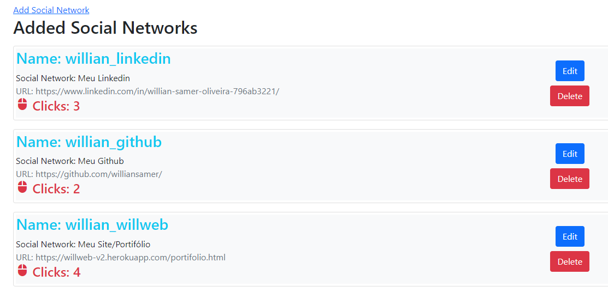

Projeto de redirecionamento de links

Desenvolvido para linkar outros diferentes sites partindo do meu domínio com um sistema de CLICKS.

Linguagens usadas:
-  EJS
-  BoostStrap
-  JavaScript
-  Nodejs
-  MongoDB

Dependências usadas do Nodejs
-  express
-  ejs
-  method-override
-  mongoose(ligação com o DB)
-  path